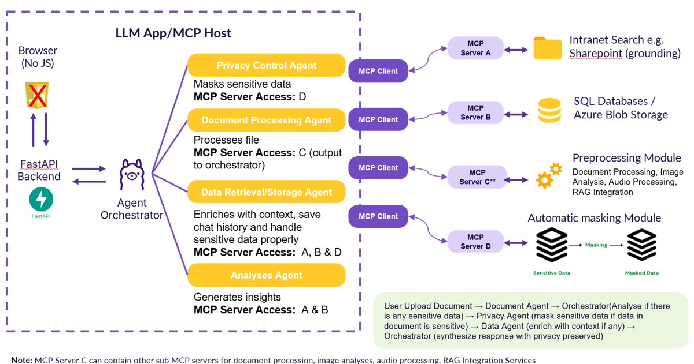

# 🧠 No-JS AI Assistant

A **JavaScript-free AI assistant** powered by FastAPI and Ollama, designed for secure environments where JavaScript is disabled or restricted.

## ✨ Key Features

- 🚫 **No JavaScript Required** - Works with pure HTML forms
- 🤖 **Local LLM Models** - Powered by Ollama (e.g., mistral, llama3, phi3, tinyllama)
- 💬 **Smart Chat Memory** - Maintains conversation context (last 10 messages)
- 🏷️ **Auto Title Generation** - AI generates chat titles from first message
- ⏳ **No-JS Waiting States** - Auto-refresh shows AI "thinking" without JavaScript
- 🗄️ **Persistent History** - SQLite database stores all conversations
- 🐳 **Docker Ready** - Complete containerized setup
- 🔒 **Security First** - Input validation, rate limiting, XSS protection

## 📋 Tech Stack

| Component | Technology | Justification |
|-----------|------------|---------------|
| **Backend** | **FastAPI** | Modern Python framework with excellent validation, async support, auto-documentation, and built-in type hints. Speeds up development with less boilerplate compared to Flask/Django. |
| **AI Engine** | **Ollama** | OpenAI-compatible REST API with full Docker support and model flexibility. Enables backend-to-frontend communication without GUI dependency, perfect for headless deployment and dynamic model switching. |
| **Database** | **SQLite** | Embedded, zero-config, file-based database with no external dependencies. Ideal for local deployment, lightweight Docker containers, and easy debugging with standard SQL tools. |
| **Frontend** | **HTML + CSS + Jinja2** | Security requirement with universal compatibility. Pure HTML/CSS ensures no JavaScript vulnerabilities while Jinja2 provides server-side templating. |


### Why These Choices?

#### **FastAPI vs Alternatives**
- ✅ **Developer Experience**: Built-in docs, type hints, and validation reduce development time
- ✅ **AI/LLM Ecosystem**: Python is the standard for AI/ML with rich integration libraries (Langchain, Transformers)
- ✅ **Performance**: Async support and fast enough for single-user/low-volume use cases
- ✅ **Direct Integration**: Can use requests, httpx, and transformers directly without language barriers

#### **Ollama vs LM Studio**
- ✅ **API-First**: Full OpenAI-compatible REST API out of the box vs GUI-focused approach
- ✅ **Headless Ready**: Production-ready for backend integration without GUI dependency
- ✅ **Model Flexibility**: Easy HTTP POST model switching vs manual GUI model loading
- ✅ **Docker Native**: Built for containerization with official Docker images
- ✅ **Lightweight**: Configurable resource usage vs heavy GUI and process overhead

#### **SQLite vs PostgreSQL**
- ✅ **Zero Setup**: File-based, no server process or user credentials needed
- ✅ **Docker Friendly**: Single .db file with volume mounts vs dedicated container setup
- ✅ **Local Development**: Easy inspection with DB Browser and standard SQL tools
- ✅ **Deployment Simplicity**: No external services, ports, or connection management
- ✅ **Sufficient Scale**: Perfect for single-user AI assistant with low concurrency needs

## 🏗️ Architecture

     

- **Frontend**: HTML forms + CSS + Jinja2 templates
- **Backend**: FastAPI with form-based communication  
- **AI Engine**: Ollama HTTP API (OpenAI-compatible)
- **Database**: SQLite for chat history and sessions

## 📋 Prerequisites

### 01 **Application Installation**
- **Ollama** and **Docker Desktop**
### 02 **Important Numbers**
- **20GB minimum storage** (Ollama models pulled, docker images and Docker Desktop, logs and chat.db)
- **Ports 8000 and 11434** must be free
### 03 **Internet access (initial setup)**
- Docker image downloads, LLM model downloads, package dependencies

## 🚀 Set up Instructions
1. Download Ollama and Docker Desktop     
2. git clone the repository      
```bash
# Clone and start
git clone https://github.com/mingxiuuuuu/nojs_ai_assistant_with_ollama.git
cd nojs_ai_assistant_with_ollama
```

## 📂 Project Structure

```
├── .gitattributes         # Git line ending configuration for cross-platform compatibility
├── .gitignore             # Git ignore rules for logs, cache, and environment files
├── Dockerfile             # Container build instructions for no js ai assistant 
├── main.py                # FastAPI application
├── config.py              # Configuration management
├── docker-compose.yml     # Container orchestration of ollama and nojs-ai
├── deploy-acr-aci.sh      # Azure deployment script for ACR and ACI
├── startup.sh             # Automated setup script for deployment 
├── requirements.txt       # Python dependencies
├── chat_history.db        # Main SQLite database (ignored by git)
├── services/
│   ├── __init__.py       # Package initialization
│   ├── ollama_service.py # LLM model integration
│   └── database_service.py # SQLite operations
├── utils/
│   ├── __init__.py       # Package initialization
│   ├── validators.py     # Input validation
│   ├── logging_config.py # Logging setup
│   ├── rate_limiter.py   # Rate limiting
│   └── timezone_utils.py # Timezone utilities
├── middleware/
│   ├── __init__.py       # Package initialization
│   └── security.py      # Security middleware
├── app/
│   └── templates/
│       └── index.html    # Main UI template
├── chat_data/            # Database storage directory
│   ├── .gitkeep         # Preserves folder structure in git
│   └── chat.db          # SQLite database (ignored by git)
├── logs/                 # Application logs (ignored by git)
│   ├── .gitkeep         # Preserves folder structure in git
│   ├── app.log          # General application logs
│   ├── error.log        # Error logs
│   └── performance.log  # Performance monitoring logs
├── images/               # Documentation images
│   ├── 2-phases.png
│   ├── Architecture_diagram.png
│   ├── agent_mcp.png
│   ├── docker.png
│   ├── smart_title_generation.png
│   ├── stateless_llm_challenge.png
│   └── successful_setup.png
└── Documentation/
    ├── API.md           # API documentation
    ├── architecture_doc.md # System architecture
    ├── cloud_deployment_guide.md # Cloud deployment instructions
    └── security_doc.md     # Security documentation
```

## 🚀 Local Development Guide        
Ensure that Docker Desktop is running in the background, run the following command:
```bash
# Automated setup (recommended)
chmod +x startup.sh # for the first time 
startup.sh # only this line for subsequent times
```
**Access**: http://localhost:8000


📖 **For details on Azure Cloud deployment**, see:
- [Cloud Deployment Guide](Documentation/cloud_deployment_guide.md) - Step-by-step deployment instructions

### 🔧 What startup.sh Does

**startup.sh** automates the complete deployment process:
- ✅ **Builds and starts** Docker containers
- ✅ **Waits for Ollama** to be ready
- ✅ **Downloads LLM models** 
- ✅ **Verifies the installation**
- ✅ **Fully functional** AI assistant at http://localhost:8000

### 🔧 Troubleshooting

**Common Issues**:
- **Models not found**: Run `./startup.sh` or manually pull models
- **Port conflicts**: Ensure ports 8000 and 11434 are available  
- **Ollama connection**: Check `docker-compose logs ollama`

**Reset everything**:
```bash
docker-compose down -v  # ⚠️ Deletes all data
chmod +x startup.sh
./startup.sh
```

### 🐳 Docker Services
Use of Docker Compose to service the orchestration for multi-container deployment. Simplifies setup with automatic service discovery and persistent volume management. The application runs as two containerized services that work together:     

      

**Ollama Service** 
- **Purpose**: Hosts the AI language models and provides the inference API
- **Image**: `ollama/ollama:latest` - Official Ollama container
- **Port**: `11434` - Standard Ollama API port
- **Storage**: Persistent volume for downloaded models (`ollama_data:/root/.ollama`)
- **Features**: Auto-restart, optional GPU support for faster inference

**NoJS AI Assistant**
- **Purpose**: FastAPI web application serving the chat interface
- **Build**: Custom container built from local Dockerfile
- **Port**: `8000` - Web interface accessible at http://localhost:8000
- **Storage**: 
  - `./chat_data:/app/data` - SQLite database persistence
  - `./logs:/app/logs` - Application logs
- **Dependencies**: Waits for Ollama service to be ready

From `docker-compose.yml`:

```yaml
services:
  ollama:
    image: ollama/ollama:latest
    container_name: ollama-service
    ports:
      - "11434:11434"
    volumes:
      - ollama_data:/root/.ollama
    restart: unless-stopped
    
  nojs-ai:
    build: .
    container_name: nojs-ai-assistant
    ports:
      - "8000:8000"
    volumes:
      - ./chat_data:/app/data    # Database persistence
      - ./logs:/app/logs         # Log files
    environment:
      - DB_PATH=/app/data/chat.db
      - OLLAMA_URL=http://ollama:11434
    depends_on:
      - ollama
    restart: unless-stopped

volumes:
  ollama_data:  # Persistent storage for LLM models
```

## 🔄 How No-JS Chat Works Real Time without JS? 
     

Unlike JavaScript chat apps, this uses a **two-phase approach**:

1. **Immediate Response**: User message saved → redirect with `?waiting=true`
2. **AI Generation**: Background task generates response → auto-refresh shows result

```python
# From main.py - Key implementation
await db_service.save_message("user", message, session_id)
return RedirectResponse(f"/chat/{session_id}?waiting=true", status_code=303)
```

**Auto-refresh mechanism** (from `index.html`):
```html

<meta http-equiv="refresh" content="2">

```

## 🧠 Memory & Context

### 🎯 Challenge: Stateless LLM

**Ollama LLM**: Stateless, no memory in between requests  
**Our Solution**: Database & 10 message sliding window creates conversation memory for the LLM → **Context aware response** allowing for conversation continuity across multiple exchanges

**Context Management** (from `main.py`):
```python
# Retrieves last 10 messages for context
context_messages = await db_service.get_conversation_history(session_id, limit=10)

# Sends to Ollama with context
reply = await ollama_service.generate_response(
    model=model,
    prompt=message,
    context=context_messages[:-1]  # Exclude current message
)
```


### 🎯 Challenge: Generic Chat Title for each Chat Session 
**Smart Title Generation**: AI automatically creates chat titles from first user message:
```python
# Check if this is the first user message in the session
should_generate_title = False
current_session = await db_service.get_session(session_id)
if current_session:
    message_count = current_session.get('message_count', 0)
    if message_count == 0:
        should_generate_title = True

# Generate title if needed
if should_generate_title:
    title_prompt = f"""
Analyze this conversation starter and create a concise title (3-7 words):
"{chat_request.message[:200]}"

Return only the title, nothing else.
"""
    generated_title = await ollama_service.generate_response(
        model=chat_request.model,
        prompt=title_prompt
    )
    clean_title = generated_title.strip().strip('"').strip("'").strip()
    
    # Only update if title has at least 3 words
    if clean_title and len(clean_title.split()) >= 3:
        await db_service.update_session_title(session_id, clean_title)
```


## ⚙️ Configuration

All configuration is managed through environment variables. Create a `.env` file to override defaults, for instance:

```bash
# Core Settings
ENVIRONMENT=development
HOST=127.0.0.1
PORT=8000

# Ollama Configuration
OLLAMA_URL=http://127.0.0.1:11434
DEFAULT_MODEL=llama3

# Database
DATABASE_URL=sqlite:///./chat_history.db

# Security & Rate Limiting
RATE_LIMIT_REQUESTS_PER_MINUTE=60
MAX_MESSAGE_LENGTH=10000
```
**Note:** There is no need to create a `.env` file if you are happy with the default values. 

📖 **For complete configuration details**, see:
- [Architecture Documentation](Documentation/architecture_doc.md#configuration-architecture) - Configuration hierarchy and validation

## 🔒 Security Features
**Core Security Implementations**:
- **Input Validation**: Pydantic models with XSS protection
- **Rate Limiting**: 60 requests/minute per IP, 10 for AI calls
- **Security Headers**: XSS protection, content type sniffing prevention
- **HTML Escaping**: All user content sanitized

### 🛡️ Security.py - Active Protection
**Purpose**: Real-time request filtering and attack prevention

- **Blocks malicious requests** before they reach your app
- **Enforces rate limits** to prevent abuse
- **Validates request content** for safety
- **Adds security headers** to responses
- **Immediate action** - stops threats in real-time

🔐 **For comprehensive security details**, see:
- [Security Documentation](Documentation/security_doc.md) - Complete security architecture, validation, rate limiting, and production hardening

### 📊 Logging Files - Monitoring & Analysis
The application provides health checks, metrics, and structured logging for production monitoring.
**Purpose**: Recording, tracking, and analyzing what happened

- **Records everything** that occurs (good and bad)
- **Provides audit trails** for compliance
- **Enables forensic analysis** after incidents
- **Tracks performance** and system health
- **Historical data** - helps identify patterns over time

### Quick Access
- **Health Check**: `GET /health` - Service status and response times
- **Metrics**: `GET /metrics` - Usage statistics and performance data
- **Logs**: `logs/app.log`, `logs/error.log`, `logs/performance.log`

📖 **For detailed monitoring information**, see:
- [API Documentation](Documentation/API.md#health-and-monitoring) - Complete endpoint specifications

### 🔄 How They Work Together
**Security.py (Prevention) → Logging (Detection/Analysis)**

```python
# In SecurityMiddleware
if attack_detected:
    # 1. BLOCK the attack (security.py)
    raise HTTPException(status_code=400, detail="Attack blocked")
    
    # 2. LOG the incident (logging files)
    log_error(
        SecurityViolation("XSS attempt detected"),
        context={'ip': client_ip, 'attack_type': 'xss'}
    )
```

## 🚀 Further Improvements

### 1. Multi-Modal Input Support
**Innovation**: Attachments of files (images, documents, audio, and other formats) using server-side processing.

**Implementation**:
- **Document Processing**: PDF, DOCX parsing with RAG-based system backend for document querying (optimized for Ollama's smaller context windows)
- **Image Analysis**: File upload with vision-capable models (LLaVA, GPT-4V alternatives)
- **Voice Input**: HTML5 with server-side speech recognition using Whisper

**User Benefit**: Users in secure environments can work with classified documents or use hands-free operation while maintaining the no-JS security boundary.

**Use Case**: A security analyst could upload a suspicious document image for AI threat analysis without client-side processing, maintaining air-gap security. Sensitive document chats can be automatically purged after designated timing (if required).

### 2. Intelligent Context Persistence with Privacy Controls
**Innovation**: Advanced context management with automatic masking for privacy protection and sensitivity.

**Current Limitation**: Simple 10-message sliding window loses valuable context.

**User Benefit**: Maintains conversational coherence across long sessions while automatically masking sensitive information in user queries before passing to LLM. Advanced context management can be handled through database MCP servers which LLM has access to. 

**Use Case**: An officer working on multi-day analysis could have the AI remember project-specific context while ensuring protection of personal information with auto-masking of sensitive details or identifiers mentioned in passing.

### 3. Collaborative Workspaces
**Innovation**: Session sharing and collaboration features without compromising security.

**Implementation**:
- **Read-only Session Sharing**: Secured discussion via secure tokens
- **Audit Trails**: Complete tracking for shared sessions
- **Export Capabilities**: Standard formats (PDF, markdown) for reporting

**User Benefit**: Teams in secure environments can collaborate on AI-assisted analysis while maintaining access controls and audit requirements.

**Use Case**: Assessment teams could share AI conversations analyzing contract terms or project proposals (using LLM as judge), with senior partners having full access while junior associates have read-only access to specific conversation branches.

### 4. Specialized Agent Architecture with MCP Protocol Integration
**Innovation**: Modular agent-based system with role-specific access controls and Model Context Protocol (MCP) server integration.

**Implementation**:
- **Agent Orchestrator**: Manages workflow coordination and intelligent routing based on content sensitivity
- **Privacy Control Agent**: Exclusive access to masking modules (MCP Server D) for automated PII detection and redaction
- **Document Processing Agent**: Isolated access to preprocessing modules (MCP Server C) for file parsing, OCR, and content extraction
- **Data Retrieval/Storage Agent**: Controlled access to databases and search systems (MCP Servers A & B) with privacy handling
- **Analysis Agent**: Read-only access to data sources (MCP Servers A & B) for insight generation and reporting



**Technical Architecture**: Agent-to-server access matrix ensures no single component can compromise the entire system, with MCP protocol providing standardized, secure communication channels.

**User Benefit**: Each agent operates with principle of least privilege, creating specialized expertise while maintaining strict security boundaries. The orchestrator intelligently routes sensitive data through privacy controls only when needed.

**Use Case**: Legal teams uploading contract documents would have the orchestrator automatically detect confidential clauses, route through privacy masking, then allow the analysis agent to generate insights on standard terms without exposing sensitive client information. Complete audit trails track agent access at each step using Langfuse.


